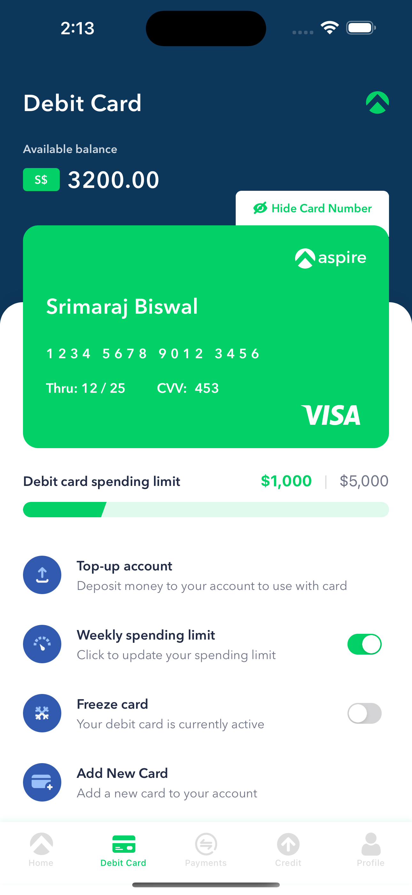
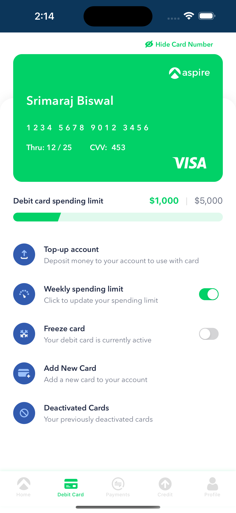
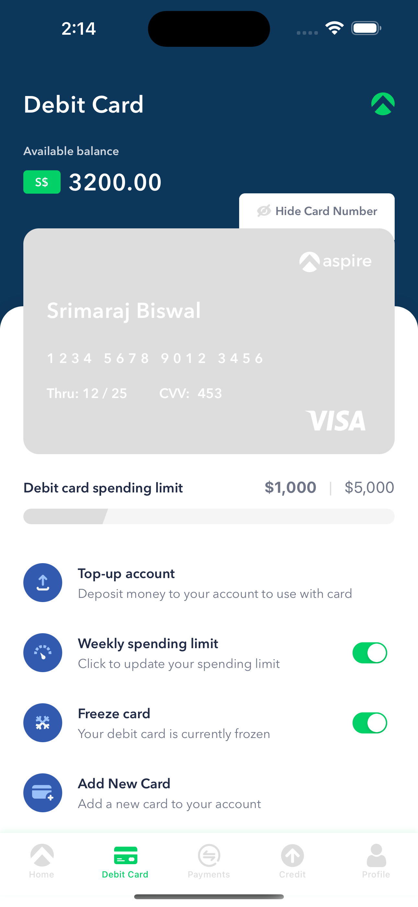
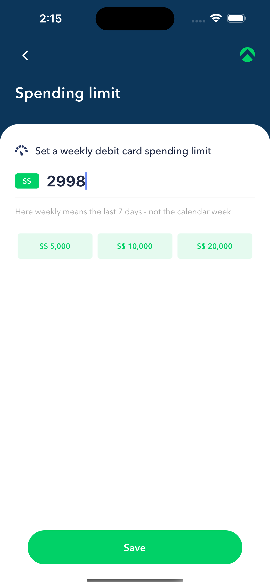
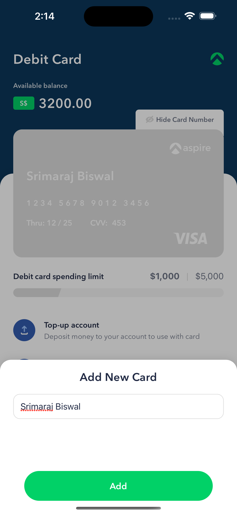
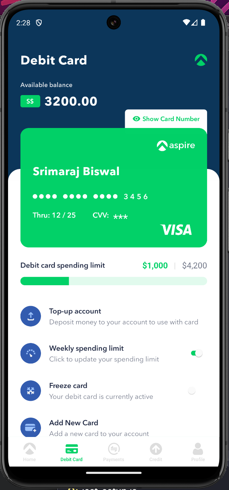

# Cards App

## About
A React Native mobile application for managing debit cards, featuring a modern UI with card management capabilities, spending limits, and card freezing functionality.

## Project Structure
```
src/
├── api/          # API integration and services
├── components/   # Reusable UI components
├── config/       # App configuration files
├── constants/    # App-wide constants and enums
├── dumyData/     # Mock data for development
├── hooks/        # Custom React hooks
├── navigation/   # Navigation configuration
├── screens/      # App screens
├── store/        # Redux store and slices
├── types/        # TypeScript type definitions
└── utils/        # Utility functions
```

## How to Run

### Prerequisites
- Node.js (v14 or higher)
- npm or yarn
- React Native development environment setup
- Android Studio (for Android development)
- Xcode (for iOS development, macOS only)

### Installation Steps
1. Clone the repository
```bash
git clone [repository-url]
cd CardsApp
```

2. Install dependencies
```bash
npm install
# or
yarn install
```

3. Install iOS dependencies (macOS only)
```bash
cd ios
bundle install
bundle exec pod install
cd ..
```

4. Start the Metro bundler
```bash
npm start
# or
yarn start
```

5. Run the app
```bash
# For Android
npm run android
# or
yarn android

# For iOS (macOS only)
npm run ios
# or
yarn ios
```

## Developer Notes

### State Management
- Redux Toolkit for state management with a single source of truth
- **Redux Saga** middleware for handling complex async operations
  - Manages side effects and < mock > API calls
  - Handles optimistic updates and error scenarios
  - Provides better control over async flow

### Data Management
- The app uses **MMKV**  storage as the source of truth for all API data
- API calls are mocked to simulate real-world scenarios while maintaining data persistence
- **Optimistic updates** are implemented for critical actions (e.g., card freezing) to enhance user experience
  - UI updates immediately reflect user actions
  - Failed API calls trigger automatic state rollback

### Testing & Quality
- Comprehensive test coverage for all components
- Unit tests ensure component reliability and maintainability
- Integration tests validate component interactions

### UI/UX Features
- Smooth animations implemented for:
  - Scroll interactions
  - Modal transitions
  - Card interactions
- Custom app icon been implemented
- Visual documentation maintained in the Screenshots folder
  - Includes both Android and iOS implementations
  - Documents various app states and interactions

## Screenshots
<table>
<tr>
<td></td>
<td></td>
</tr>
<tr>
<td></td>
<td></td>
</tr>
<tr>
<td></td>
<td></td>
</tr>
</table>

# Getting Started

> **Note**: Make sure you have completed the [Set Up Your Environment](https://reactnative.dev/docs/set-up-your-environment) guide before proceeding.

## Step 1: Start Metro

First, you will need to run **Metro**, the JavaScript build tool for React Native.

To start the Metro dev server, run the following command from the root of your React Native project:

```sh
# Using npm
npm start

# OR using Yarn
yarn start
```

## Step 2: Build and run your app

With Metro running, open a new terminal window/pane from the root of your React Native project, and use one of the following commands to build and run your Android or iOS app:

### Android

```sh
# Using npm
npm run android

# OR using Yarn
yarn android
```

### iOS

For iOS, remember to install CocoaPods dependencies (this only needs to be run on first clone or after updating native deps).

The first time you create a new project, run the Ruby bundler to install CocoaPods itself:

```sh
bundle install
```

Then, and every time you update your native dependencies, run:

```sh
bundle exec pod install
```

For more information, please visit [CocoaPods Getting Started guide](https://guides.cocoapods.org/using/getting-started.html).

```sh
# Using npm
npm run ios

# OR using Yarn
yarn ios
```

If everything is set up correctly, you should see your new app running in the Android Emulator, iOS Simulator, or your connected device.

This is one way to run your app — you can also build it directly from Android Studio or Xcode.

## Step 3: Modify your app

Now that you have successfully run the app, let's make changes!

Open `App.tsx` in your text editor of choice and make some changes. When you save, your app will automatically update and reflect these changes — this is powered by [Fast Refresh](https://reactnative.dev/docs/fast-refresh).

When you want to forcefully reload, for example to reset the state of your app, you can perform a full reload:

- **Android**: Press the <kbd>R</kbd> key twice or select **"Reload"** from the **Dev Menu**, accessed via <kbd>Ctrl</kbd> + <kbd>M</kbd> (Windows/Linux) or <kbd>Cmd ⌘</kbd> + <kbd>M</kbd> (macOS).
- **iOS**: Press <kbd>R</kbd> in iOS Simulator.

## Congratulations! :tada:

